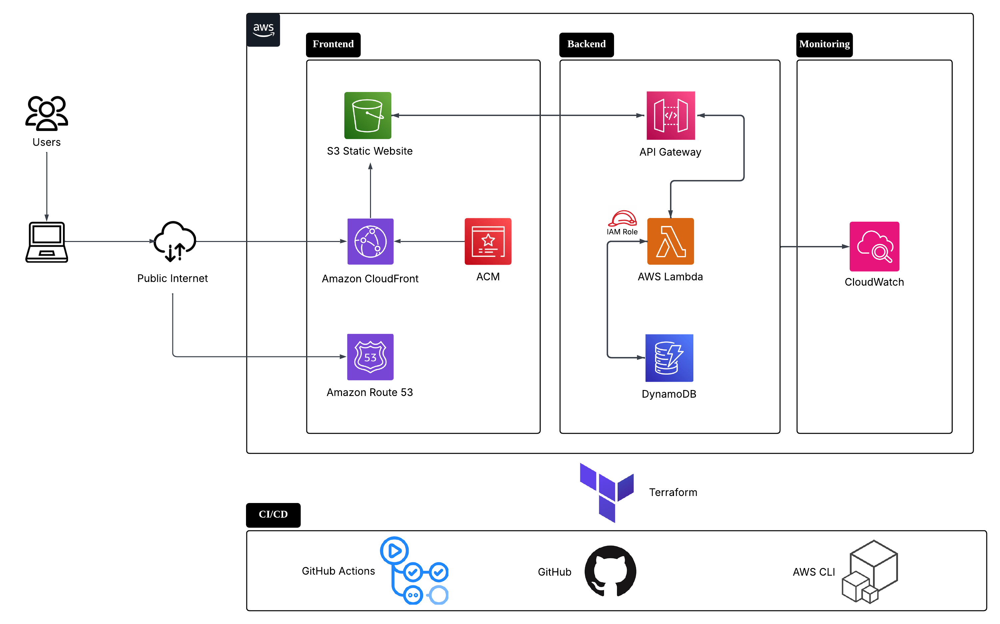

# Project Overview

> Flowchart made using Lucidchart

#### 1. User accesses my website via my custom domain
- A user enters my custom domain name (e.g., loonymoony.click) into their browser. Route 53, acting as the Domain Name System (DNS) service, resolves the domain name to the IP address of my CloudFront distribution.

#### 2. The request is directed to the nearest edge location
- The user's request is routed to the nearest CloudFront edge location to minimize latency.
    - If the requested content (e.g., HTML, CSS, JavaScript files) is already cached at the edge location (cache hit), CloudFront serves the content directly to the user.
    - If the content is not cached (cache miss), CloudFront forwards the request to the designated origin, which is my S3 static website bucket. S3 retrieves the file, and CloudFront caches it for future requests before delivering it to the user.

#### 3. Secure communication is established
- ACM is used to provision an SSL/TLS certificate for my custom domain. This certificate is associated with the CloudFront distribution, enabling secure HTTPS connections between the user's browser and the CloudFront edge locations.

#### 4. The frontend initiates a backend request
- Once the web files are loaded in the user's browser, the JavaScript code makes a POST request to the backend API. The API call is sent to a custom domain mapped to an API Gateway endpoint. API Gateway acts as the secure entry point for my backend, routing the request to the integrated Lambda function.

#### 5. The backend processes the request
- The Lambda function is invoked by API Gateway. The Lambda function, which has an associated IAM role granting it permissions to access DynamoDB, executes the logic for the visitor count. It connects to the DynamoDB table to retrieve the current count, increments it, and writes the updated count back to the table. Finally, the Lambda function returns the new visitor count in a response object, which is sent back to the user's browser via API Gateway.

 
 

# Steps to recreate project
> Note that the following steps are general guidelines. Everything from step 2 onwards has to be done using Terraform

## 1. Create AWS account
1. Under account settings, enable the setting for 'Activate IAM Access'
2. Enable MFA for the root user (later on, need enable MFA for all IAM users as well)
3. Configure a budget (additionally, under 'Billing Preferences', enable the settings there)
4. Create an IAM user with administrator privileges (use this IAM user for your all work)
5. Create an access key pair to gain AWS credentials to make changes to your AWS infra
6. Create a named profile on the CLI using the command `aws configure --profile <insert-your-profile-name-here>`
    - To test if configured properly, try `aws configure list --profile <insert-your-profile-name-here>`

## 2. Set up S3 bucket and upload web files
1. Create a bucket which allows public access
2. Go to properties tab and enable static website hosting
3. Enable all principals to view objects in the bucket using the bucket policy

## 3. Make your S3 bucket accessible via your custom domain
1. Buy and register a domain name using Route 53 (`.click` domain is cheap)
2. Create a Route 53 'A' record to route traffic from your domain to the S3 bucket

## 4. Deploy and validate public certificate using ACM
1. Create public certificate from ACM with validation method as 'DNS validation'
2. Create a CNAME record in Route 53. This is how ACM verifies that you control this domain

## 5. Set up CloudFront distribution with associated SSL cert
1. Deploy a CloudFront distribution and associate the SSL cert to enable HTTPS access
2. Create a Route 53 'A' record with Alias to the distribution (the record in step 3 is no longer needed)
3. Modify the bucket policy to only allow access from this specific distribution

## 5.1 Consideration when choosing S3 origin or custom origin
| | S3 origin | Custom origin |
| -------- | -------- | ------- |
| Public access settings | Private bucket | Public bucket |
| How to enforce request only via CloudFront | Force all traffic through CloudFront via OAC | Bucket only accepts requests with custom secret headers which are sent from CloudFront |
| Bucket policy | Only accept requests from the CloudFront distribution ARN | Accepts requests from all principals |
| Invalid object request | May need to write a CloudFront function to route requests for non-existent objects to `error.html` | Comes with native support with routing to default objects |

## 6. Deploy a DynamoDB table

## 7. Deploy a Lambda function to update visitor count in the DynamoDB table
1. Test your code on your local machine, before testing it on Lambda

## 8. Expose your Lambda via an endpoint in an API Gateway
1. Create a HTTP API
2. Integrate this API with your Lambda function
3. Configure a route for your HTTP API which is a POST method with a specific path name

## 8.1 Consideration when choosing API Gateway or Lambda Function URL
| | API Gateway | Function URL |
| -------- | -------- | ------- |
| Simplicity |  | It's a single, direct endpoint for your Lambda function. Setup is minimal |
| Cost-Effective |  | For very basic and direct invocations, it is cheaper because you do not pay for API Gateway's processing overhead |
| Custom domains | Easily map custom domains to your API Gateway endpoints |  |
| Throttling | Control API usage, set rate limits |  |
| Request/Response Transformations | Transform payloads between client, API Gateway, and Lambda | |
| Authentication & Authorisation | Integrates with Lambda authorisers/Cognito User Pools for authentication and authorisation of API requests | |
| WAF | Seamlessly integrate with AWS WAF for protection against common web exploits | |
| Caching | Enable caching at the API Gateway level to reduce load on Lambda and improve response times | |
| Versioning | Manage multiple versions of your API (e.g., /v1, /v2). | |
| Integration with AWS services | Integrate with various AWS services (Lambda, EC2, S3, Kinesis) and any HTTP endpoint | |
| Logging | Provides detailed CloudWatch metrics and access logging for all API requests | |

## 8.2 Consideration when choosing HTTP API or REST API
|  | HTTP | REST |
| -------- | -------- | ------- |
| Cost | Up to 70% cheaper per request than REST APIs |  |
| Performance | Lower latency and higher throughput |  |
| WAF | No direct integration with WAF | Can directly integrate with WAF |
| Cache | No built-in caching | Built-in caching at the API Gateway level to reduce load on backend and improve latency |
| Auth options | Supports JWT auth (for OAuth), IAM auth, basic Lambda auth | Supports a broader range of auth mechanisms, including IAM auth, Cognito User Pools auth, custom Lambda auth, API keys |
| Private APIs | No direct support for private API endpoints (you'd need a private ALB) | Can create private endpoints accessible only from within your VPC using VPC Endpoints |

## 9. Display visitor count in frontend
1. Make a simple API call to the backend API Gateway endpoint

## 10. Set up a workflow in Github Actions
1. This workflow will automatically upload your frontend code to your S3 bucket whenever you change the frontend code and push it to the master branch
2. The Github Actions runner will use environment variables stored in Github's `Repository secrets` for authentication with AWS
    - For this to work, you will need to remove the explicit declaration of your named profile in the AWS provider block -> `profile = "admin-zac-development"`
    - Before running any terraform commands, set an environment variable in your terminal -> `export AWS_PROFILE="admin-zac-development"`. This tells terraform to use this named profile for authentication with AWS
3. In order to access the same terraform.tfstate file no matter where you run `terraform apply` from (e.g. from your local machine or through GitHub actions runner), you should create a new S3 bucket and store the state file there.

## 11. Set up a nice React-based frontend using Vite
1. Test it locally. Make sure it integrates well with the API Gateway endpoint
2. Build the Vite project which generates a `dist` directory containing all the necessary static assets (HTML, CSS, JavaScript, and other files). You'll need to upload the entire contents of this directory into the S3 bucket

## 12. Draw a nice flowchart depicting the sequence of events when a user enters my website
1. Update `README` with the details

## 13. Map a custom domain name to my API Gateway endpoint
1. Request a SSL certificate from ACM for the domain `api.loonymoony.click`
2. Validate ownership of the domain
3. Create a API Gateway Custom Domain Name resource, which allows you to use a domain name that you own for your API. Here, you also associate an ACM certificate with your custom domain name 
4. Create the API Mapping, which allows API Gateway to connect API stages to a custom domain name
5. Create the Route53 DNS record that points your custom domain `api.loonymoony.click` to the API Gateway

 
 

## Quick notes about REST API design
- `PUT`: typically used for idempotent updates to a known resource. If you `PUT` the same resource multiple times with the same payload, the result should be the same as if you did it once. It's often used to update an existing resource. `PUT` is often associated with sending the entire state of the resource.
- `POST`: is used to create a new resource or to perform a non-idempotent operation on a resource. `POST` is a very common method for submitting data or triggering actions in APIs.
- `GET`: is strictly for retrieving data. A `GET` operation must not alter server state.

## Quick notes about `.json()` and `.stringify()`
- `.json()` -> Parses a JSON object, and returns a Promise that resolves to a Javascript object
- `.stringify()` -> Converts a Javascript object to JSON

 
 

# Tips to set up project
- Run `npm install` in the `/frontend` folder if the `node_modules` folder is absent 
- Run `npm run build` to generate the `dist` directory, before running `terraform plan` and `terraform apply` in the `/infrastructure/frontend` folder
- Ensure you have created a AWS named profile with access key pair credentials in your CLI, then run `export AWS_PROFILE=<insert-profile-name-here>` command in your CLI. This allows you to make changes to your AWS infrastructure by running your Terraform script. Note that there is no hard coded profile name in the Terraform code, so you can be assured that the Terraform AWS Provider will obtain AWS credentials through the `AWS_PROFILE` env variable
- You shouldn't receive a CORS error, but if you do, change the CORS configuration of the API Gateway API to allow from `*`

 
 

# Resources
- [learn.cantrill.io](https://learn.cantrill.io/) -> everything you need to know about AWS
- [Reddit post](https://www.reddit.com/r/AWSCertifications/comments/1jn6lwl/this_should_be_your_first_cloud_project_tutorial/) -> inspiration for this mini project
- [Cloud test bank](https://kankoh.notion.site/IS458-Cloud-Management-and-Engineering-f45ae284fcba4089a37d98f0e21e20cb) -> I didn't use this, but might be useful in the future for revision
- Gemini -> best LLM
- Claude -> frontend master